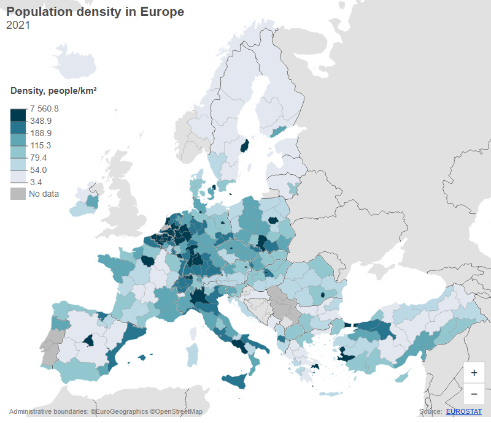
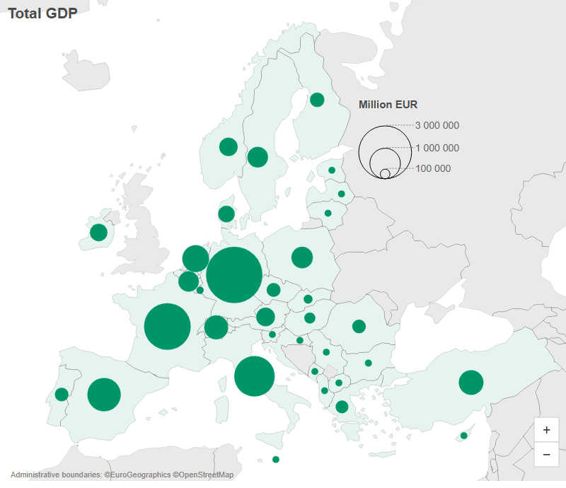
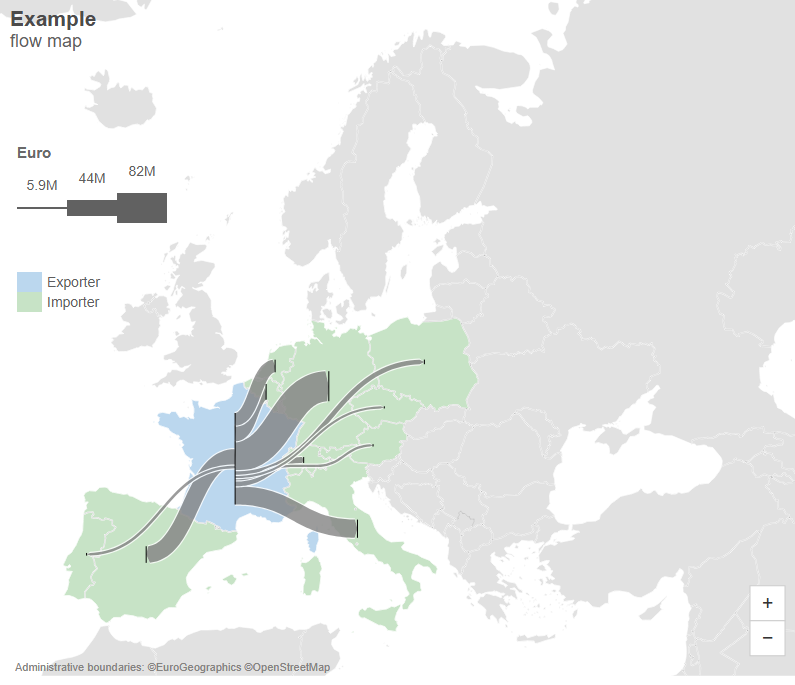
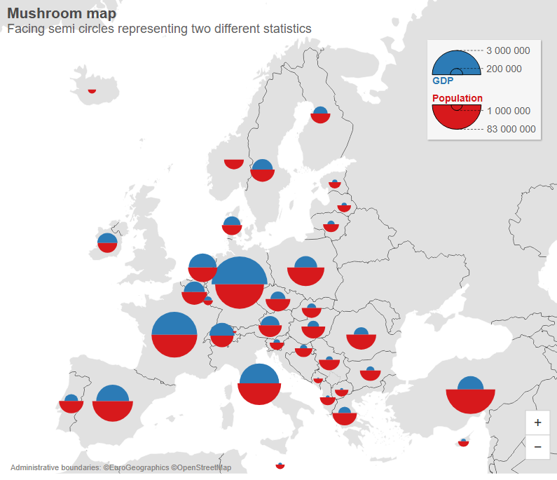
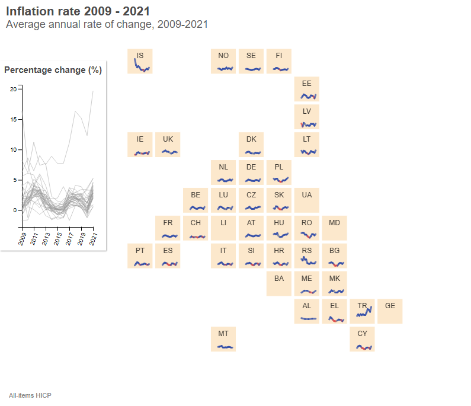
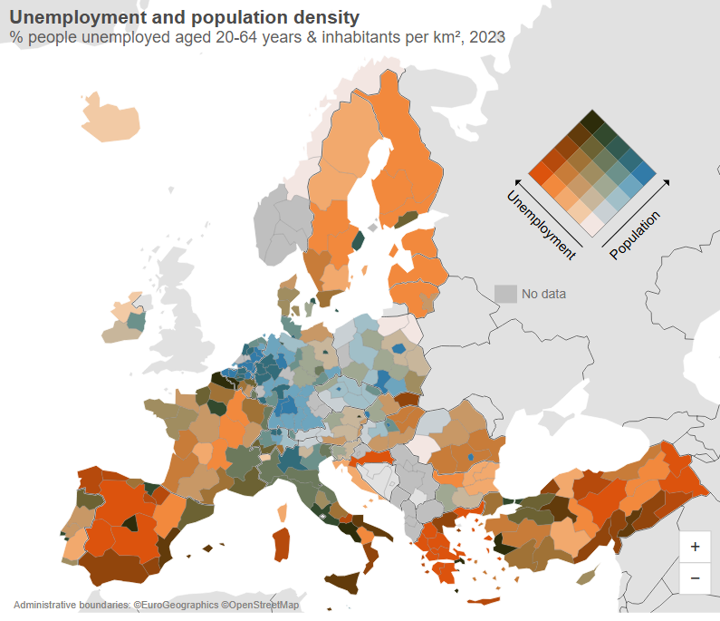
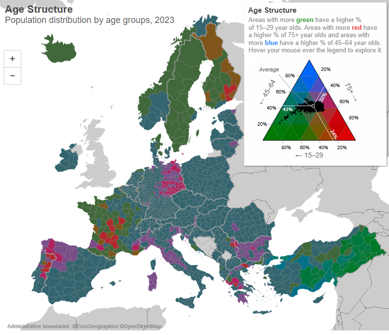
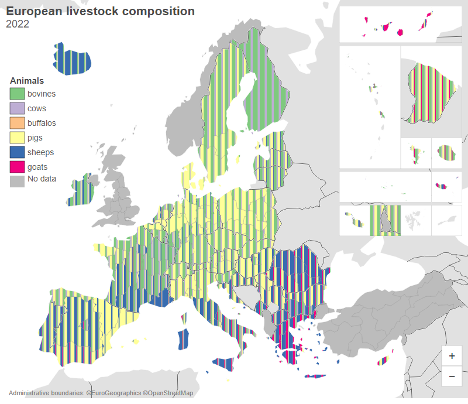

# eurostat-map: Data-Driven Maps

<div align="center">
  
  
  
  <a href="http://www.awesomeofficialstatistics.org"></a>
</div>

<br>
<div align="center">
  
</div>
<div align="center">
  <em>Build publication-ready statistical maps of Europe in minutes.</em>
</div>

<div align="center">
  D3-based mapping library for Eurostat and custom data - the engine that powers <a href="https://gisco-services.ec.europa.eu/image/" target="_blank"><strong>IMAGE</strong></a>.
</div>

<div align="center">
  <a href="docs/reference.md" target="_blank"><strong>Documentation</strong></a> ·
  <a href="https://eurostat.github.io/eurostat-map/examples/index.html" target="_blank"><strong>Live examples</strong></a> ·
  <a href="https://observablehq.com/collection/@eurostat-ws/eurostatmap-js" target="_blank"><strong>Quickstart notebook</strong></a>
</div>
<hr>

- **Interactive SVG maps** rendered using **D3.js**.
- **TypeScript support** with built-in definition typings.
- **NUTS geometries** fetched dynamically via the **Nuts2json API** (TopoJSON format).
- **Eurostat API integration** using the **JSON-stat** standard.

<hr>
<br>
<div align="center">

  <table>
    <tr>
      <td><a href="https://eurostat.github.io/eurostat-map/examples/population-density.html" target="_blank"></a></td>
      <td><a href="https://eurostat.github.io/eurostat-map/examples/prop-circles.html" target="_blank"></a></td>
      <td><a href="https://eurostat.github.io/eurostat-map/examples/flowmap.html" target="_blank"></a></td>
      <td><a href="https://eurostat.github.io/eurostat-map/examples/mushroom.html" target="_blank"></a></td>
    </tr>
    <tr>
      <td><a href="https://eurostat.github.io/eurostat-map/examples/sparklines-grid-cartogram.html" target="_blank"></a></td>
      <td><a href="https://eurostat.github.io/eurostat-map/examples/pop-unemploy-bivariate.html" target="_blank"></a></td>
      <td><a href="https://eurostat.github.io/eurostat-map/examples/trivariate.html" target="_blank"></a></td>
            <td><a href="https://eurostat.github.io/eurostat-map/examples/livestock_composition.html" target="_blank"></a></td>
    </tr>
  </table>
</div>

---

## Resources

- [Quick Start](#quick-start)
- [Examples](https://eurostat.github.io/eurostat-map/examples/index.html)
- [Documentation](#documentation)
- [About](#about)
- [Contribute](#contribute)
- [Copyright](#copyright)
- [Disclaimer](#disclaimer)

---

## Quick Start

```bash
npm install eurostat-map
```

```javascript
import eurostatmap from 'eurostat-map'
```

or

```javascript
const eurostatmap = require('eurostat-map')
```

or

```html
<script src="https://unpkg.com/eurostat-map"></script>
```

then

```javascript
eurostatmap
    .map('choropleth')
    .title('Population density in Europe')
    .stat({ eurostatDatasetCode: 'demo_r_d3dens', unitText: 'people/km²' })
    .legend({ x: 500, y: 180, title: 'Density, people/km²' })
    .build()
```

Want a guided setup? Try the notebook:
https://observablehq.com/@joewdavies/eurostat-map-js

## Documentation

For detailed documentation on what eurostat-map can do, see the **[documentation page](docs/reference.md)**.

For generated, signature-accurate API docs from TypeScript/JSDoc, see [the API docs](https://eurostat.github.io/eurostat-map/docs/api/index.html).

Anything unclear or missing? Feel free to [ask](https://github.com/eurostat/eurostat.js/issues/new)!

## About

eurostat-map is an open-source JavaScript library for building interactive, publication-ready statistical maps focused on Europe. It combines D3-based SVG rendering with direct support for Eurostat datasets (JSON-stat), NUTS geographies from Nuts2json, and custom data workflows, and includes map types such as choropleth, proportional symbols, cartograms, flow maps, and composition charts. The project is designed for analysts, journalists, and institutions that need reproducible, configurable map visualizations for both exploratory analysis and official communication.

|                |                                                                                                                                                                                       |
| -------------- | ------------------------------------------------------------------------------------------------------------------------------------------------------------------------------------- |
| _contributors_ | [](https://github.com/jgaffuri) [](https://github.com/JoeWDavies) |
| _version_      | See [npm](https://www.npmjs.com/package/eurostat-map?activeTab=versions)                                                                                                              |
| _status_       | Since 2018                                                                                                                                                                            |
| _license_      | [EUPL 1.2](https://github.com/eurostat/Nuts2json/blob/master/LICENSE)                                                                                                                 |

## Contribute

Feel free to [ask for assistance](https://github.com/eurostat/eurostat.js/issues/new), fork the project or simply star it (it's always a pleasure).

## Copyright

The [Eurostat NUTS dataset](http://ec.europa.eu/eurostat/web/nuts/overview) is copyrighted. There are [specific provisions](https://ec.europa.eu/eurostat/web/gisco/geodata/statistical-units) for the usage of this dataset which must be respected. The usage of these data is subject to their acceptance. See the [Eurostat-GISCO website](https://ec.europa.eu/eurostat/web/gisco/geodata/statistical-units) for more information.

## Disclaimer

The designations employed and the presentation of material on these maps do not imply the expression of any opinion whatsoever on the part of the European Union concerning the legal status of any country, territory, city or area or of its authorities, or concerning the delimitation of its frontiers or boundaries. Kosovo*: This designation is without prejudice to positions on status, and is in line with UNSCR 1244/1999 and the ICJ Opinion on the Kosovo declaration of independence. Palestine*: This designation shall not be construed as recognition of a State of Palestine and is without prejudice to the individual positions of the Member States on this issue.
